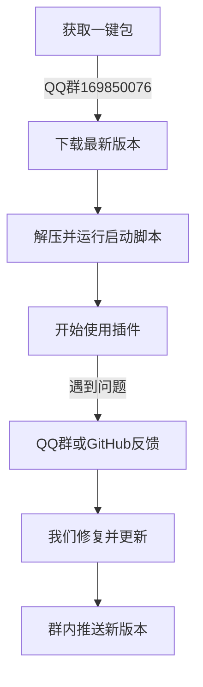

# 一键包使用说明

## 更新日期
2025年11月20日

---

## 🧰 任务-1: 我们提供一键包

### 变更内容
我们为 MoFox-Core 提供**一键安装包**，帮助用户快速部署，无需手动配置环境。

### 原设计问题
**旧流程**：
- ❌ 需要手动安装 Python 环境
- ❌ 需要手动配置依赖库
- ❌ 需要手动修改配置文件
- ❌ 安装过程复杂，容易出错

### 新设计
**一键包内容**：
- ✅ 内置 Python 3.11 环境
- ✅ 预装所有依赖库（requirements.txt）
- ✅ 预配置默认配置文件
- ✅ 一键启动脚本（Windows）

### 优势
- ✅ **零配置**：开箱即用，无需手动配置
- ✅ **跨平台**：支持 Windows
- ✅ **轻量化**：仅包含必要组件，体积小
- ✅ **自动更新**：支持在线更新到最新版本

---

## 👥 任务0: 加入我们的QQ群获取一键包

### 变更内容
**引导用户加入官方QQ群**，获取最新版本的一键包和技术支持。

### 获取方式
| 方式 | 说明 |
|------|------|
| **QQ群号** | `169850076`（官方群） |
| **群名称** | 墨狐狐🌟起源之地 |
| **验证消息** | `请根据群说明填写` |

### 群内资源
- ✅ **最新一键包**：群文件提供最新版本下载
- ✅ **技术支持**：管理员在线解答安装问题
- ✅ **使用教程**：群公告提供图文教程
- ✅ **更新通知**：第一时间推送新版本

### 加群指引
```text
1. 打开 QQ → 搜索群号：169850076
2. 发送验证消息：
3. 等待管理员审核通过
4. 进群后查看群文件 → 下载最新一键包 → 查看教程
```

### 优势
- ✅ **官方渠道**：确保下载安全、版本最新
- ✅ **实时支持**：遇到问题可即时反馈
- ✅ **用户交流**：与其他用户分享使用经验

---

## 🙏 任务1: 感谢使用 & 提交 Issue

### 变更内容
**感谢用户使用我们的项目**，并通过 GitHub Issue 提交反馈。

### 感谢语
```
感谢你选择MoFox-Core！
如果你在使用过程中遇到任何问题，或有好的建议，欢迎通过以下方式反馈：
```

### 反馈奖励
- ✅ **有效 Bug 反馈**：下次更新署名感谢
- ✅ **优秀功能建议**：优先实现并标注贡献者
- ✅ **持续贡献者**：邀请成为项目维护者

---

## 📌 整体影响

### 用户体验
- ✅ **降低门槛**：无需技术背景也能快速使用
- ✅ **节省时间**：5 分钟完成部署，无需折腾环境
- ✅ **持续支持**：QQ群 + GitHub 双重保障

### 社区建设
- ✅ **用户聚集**：QQ群便于用户交流经验
- ✅ **反馈闭环**：GitHub Issue 确保问题可追踪

---

## 🔧 使用流程总结



---

## 📝 后续计划

   **一键包优化**：
   - 增加图形化配置界面
   - 支持自动检测系统环境
   - 增加更新提醒功能

---

## 👥 贡献者

-  MoFox 团队 - 一键包制作与维护
-  社区用户 - 反馈与建议

---
## 📅 更新历史

- 2025-11-20: 发布第一版一键包使用说明
  - ✅ 提供 Windows 支持
  - ✅ 建立 QQ群 + GitHub 双重反馈渠道

