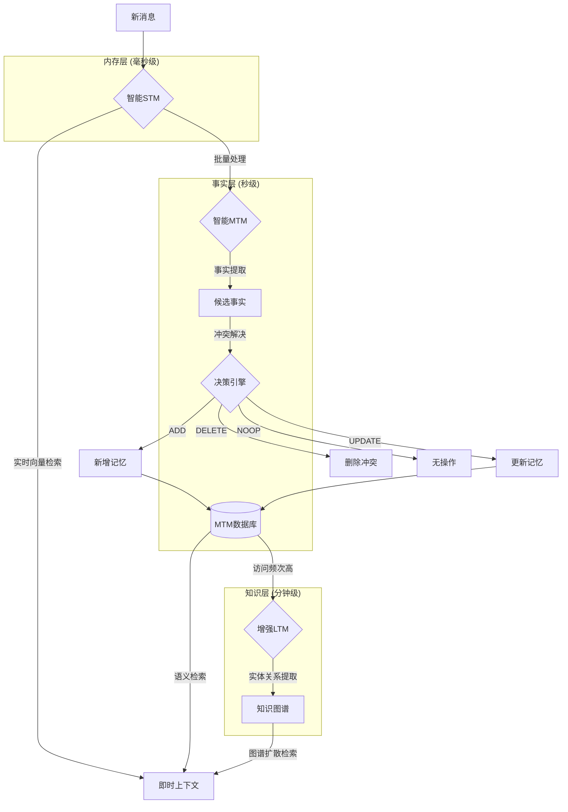
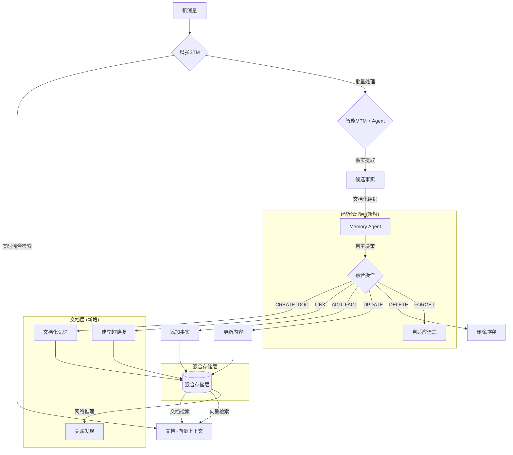

# MoFox_Bot记忆系统架构 v3.0 设计文档
*融合 Mem0 先进理念的生产级记忆系统*

## 🎯 1. 核心思想

本架构借鉴 **Mem0** 的先进设计思路，建立一个**智能化、高效率、可扩展**的记忆系统。系统采用**事实导向**的记忆管理，通过**双阶段智能处理**实现从碎片化信息到结构化知识的转化，支持**语义检索**和**关系推理**。

### 设计原则
- **智能优于规则**：使用LLM进行事实提取和冲突解决，而非简单的阈值判断
- **效率优于完整**：关注核心事实，避免信息冗余和重复处理
- **语义优于字面**：基于向量相似度的语义检索，而非关键词匹配
- **异步优于同步**：记忆处理不阻塞主对话流程

## 📚 2. 三层架构详解

### 2.1. 智能短期记忆 (STM - Smart Short-Term Memory)

**定位**：高速语义缓存 + 智能事实提取器

#### 核心功能
- **消息缓冲**：内存队列存储最近的对话消息（建议200条）
- **实时向量化**：消息入队时异步生成语义向量
- **语义检索**：基于相似度快速检索相关历史上下文
- **事实提取**：智能识别并提取对话中的重要事实

#### 技术架构
- **内存队列**：使用定长双端队列（deque）存储最近消息
- **向量缓存**：每条消息的embedding向量缓存在内存中
- **索引结构**：使用FAISS或Annoy等高效向量索引库
- **处理流程**：消息入队 → 异步向量化 → 索引更新 → 批量转移判断

#### 触发机制
- **定时批处理**：每隔一定时间（如5分钟）处理一批消息
- **队列满载**：队列达到容量时触发批量转移
- **对话间隙**：检测到对话暂停时进行处理

### 2.2. 智能中期记忆 (MTM - Smart Mid-Term Memory)

**定位**：事实管理器 + 冲突解决器（借鉴Mem0双阶段处理）

#### 双阶段处理流程

##### 阶段一：事实提取 (Extraction Phase)
**输入源**：消息批次 + 对话摘要 + 最近10条消息  
**输出结果**：结构化的候选事实列表

**提取内容**：
1. 用户偏好和习惯
2. 重要的个人信息  
3. 关键的决定和计划
4. 情感状态变化

**处理方式**：使用LLM分析对话内容，输出JSON格式的事实数据，包含内容、重要性评分、事实类型等元数据。

##### 阶段二：冲突解决 (Update Phase)
**处理流程**：
1. 检索相似的现有记忆（top-k语义搜索）
2. LLM分析新事实与现有记忆的关系
3. 智能决策操作类型

**操作类型**：
- **ADD**：添加全新记忆
- **UPDATE**：更新现有记忆内容 
- **DELETE**：删除矛盾或过时记忆
- **NOOP**：无需任何操作

**决策机制**：基于语义相似度和时间戳，LLM判断最合适的操作，确保记忆库的一致性和准确性。

#### 记忆元数据结构
每个记忆事实包含以下属性：
- **基础信息**：唯一ID、内容文本、关键词列表
- **语义信息**：向量化embedding、重要性评分、事实类型
- **时间信息**：创建时间、最后访问时间、访问计数
- **归属信息**：对话ID、用户ID
- **事实类型**：用户偏好、个人信息、计划安排、情感状态等

### 2.3. 增强长期记忆 (LTM - Enhanced Long-Term Memory)

**定位**：知识图谱 + 关系推理引擎（集成现有Hippocampus）

#### 晋升机制
- **访问频次**：`access_count >= 10` 的记忆事实
- **重要性评分**：`importance_score >= 0.8` 的高价值信息
- **时间持久性**：存在超过7天且仍被访问的记忆

#### 图谱增强（借鉴Mem0g）
**技术组件**：
- **实体提取器**：从记忆事实中识别人物、地点、概念等实体
- **关系构建器**：分析实体间的语义关系，构建三元组
- **图谱集成器**：将新的实体关系融入现有知识图谱

**处理流程**：
1. 对晋升的记忆事实进行实体提取
2. 构建实体间的关系三元组
3. 与现有Hippocampus知识图谱进行集成
4. 支持复杂的多跳推理和关系查询

## 🔄 3. 信息处理流程



## ⚙️ 4. 配置体系

### 4.1. 核心配置
```toml
[memory_v3]
enable = true
processing_mode = "async"  # async/sync

[memory_v3.stm]
max_size = 200
batch_size = 50
vector_index_type = "faiss"  # faiss/annoy
similarity_threshold = 0.75
embedding_model = "text-embedding-3-small"

[memory_v3.mtm]
fact_extraction_batch_size = 20
importance_threshold = 0.6
conflict_resolution_top_k = 10
max_facts_per_batch = 50

[memory_v3.ltm]
promotion_access_threshold = 10
promotion_importance_threshold = 0.8
promotion_time_threshold = 604800  # 7天(秒)
enable_graph_enhancement = true
```

### 4.2. 性能配置
```toml
[memory_v3.performance]
max_concurrent_extractions = 3
llm_timeout = 30
vector_cache_size = 10000
enable_compression = true
compression_ratio = 0.1

[memory_v3.personalization]
enable_user_profiling = true
enable_context_adaptation = true
enable_emotional_weighting = true
```

## 🚀 5. 性能优化策略

### 5.1. 异步处理管道
**设计理念**：主流程与记忆处理分离，确保对话响应速度

**处理模式**：
- **前台处理**：立即从STM检索相关上下文，快速响应用户
- **后台处理**：异步进行事实提取、冲突解决和记忆更新
- **流水线处理**：多个消息可以并行处理，提高整体吞吐量

### 5.2. 批量优化
- **批量向量化**：减少模型调用次数
- **批量数据库操作**：提高I/O效率
- **批量LLM推理**：降低API成本

### 5.3. 缓存策略
- **向量缓存**：常用embedding保存在内存中
- **查询缓存**：相似查询复用结果
- **LRU淘汰**：自动清理过期缓存

## 🛡️ 6. 错误处理与降级

### 6.1. 分层降级机制
**LLM失效降级**：
- 事实提取失败 → 基于规则的关键词提取
- 冲突解决失败 → 简单的时间戳去重
- 重要性评分失败 → 基于消息长度的启发式评分

**向量服务降级**：
- 向量检索失败 → 降级到关键词匹配
- 向量化失败 → 使用TF-IDF等传统方法
- 索引异常 → 临时使用线性搜索

### 6.2. 容错机制
- **超时保护**：LLM调用超时自动降级
- **重试机制**：网络错误自动重试（指数退避）
- **数据备份**：关键记忆多副本存储
- **状态恢复**：系统重启后自动恢复处理状态

## 🎨 7. 个性化与适应性

### 7.1. 用户画像集成
**画像维度**：
- **兴趣领域**：用户关注的话题和偏好
- **沟通风格**：正式/非正式、简洁/详细等
- **记忆偏好**：希望记住的信息类型和重点

**个性化机制**：
- 根据用户兴趣调整事实重要性评分
- 基于沟通风格优化记忆表达方式
- 考虑用户偏好决定记忆保留策略

### 7.2. 情境感知记忆
- **时间感知**：工作时间 vs 休闲时间的记忆优先级
- **场景感知**：群聊 vs 私聊的记忆策略差异
- **情绪感知**：情感状态影响记忆权重

### 7.3. 动态参数调整
**调整策略**：
- **性能导向**：根据准确性和延迟指标自动调整阈值
- **使用模式导向**：基于用户行为模式优化配置
- **资源导向**：根据系统负载动态调整处理参数

**调整范围**：
- 事实提取的重要性阈值
- 批处理的大小和频率
- 向量检索的相似度阈值
- 记忆晋升的访问次数阈值

## 📊 8. 监控与分析

### 8.1. 关键指标
- **记忆质量**：事实准确性、相关性评分
- **系统性能**：检索延迟、处理吞吐量
- **用户体验**：记忆命中率、回复连贯性
- **资源使用**：token消耗、内存占用

### 8.2. 分析面板
**统计维度**：
- **STM指标**：队列使用率、命中率、向量化效率
- **MTM指标**：事实提取成功率、冲突解决准确性、存储增长
- **LTM指标**：晋升率、图谱规模、推理查询性能
- **用户行为**：记忆访问模式、偏好变化趋势
- **系统性能**：处理延迟、资源消耗、错误率

## 🛣️ 9. 实施路线图

### 阶段一：基础重构（2周）
- [ ] 重写STM为真正的内存队列
- [ ] 实现基础向量检索
- [ ] 添加异步处理框架

### 阶段二：智能升级（3周）
- [ ] 实现双阶段MTM处理
- [ ] 集成事实提取和冲突解决
- [ ] 完善配置体系

### 阶段三：性能优化（2周）
- [ ] 批量处理优化
- [ ] 缓存策略实现
- [ ] 错误处理完善

### 阶段四：个性化增强（2周）
- [ ] 用户画像集成
- [ ] 动态参数调整
- [ ] 监控分析系统

## 🎯 10. 预期效果

基于Mem0的benchmark数据，预期实现：
- **准确性提升**：比现有系统提高20-30%
- **延迟降低**：检索延迟控制在200ms以内
- **成本节约**：token使用量减少80%以上
- **用户体验**：记忆连贯性显著改善

---

*本设计文档融合了Mem0的先进理念与MMC项目的实际需求，旨在构建一个真正生产级的智能记忆系统。* 

## 🔍 11. MemU 架构分析与融合思路

### 11.1. MemU vs Mem0 设计哲学对比

在调研过程中，我们发现了另一个优秀的记忆框架 **MemU**，其设计理念为我们的架构提供了新的思路。

#### 核心差异分析

| 维度 | 当前架构 (基于Mem0) | MemU架构 | 优势对比 |
|------|------------------|---------|----------|
| **存储方式** | 向量数据库 + 结构化事实 | 文档化记忆 + 文件系统 | MemU: 上下文完整性；Mem0: 精确检索 |
| **处理流程** | 双阶段：提取→冲突解决 | 代理驱动：自主决策 | MemU: 自适应性；Mem0: 可控性 |
| **知识组织** | 层级晋升 (STM→MTM→LTM) | 网络化超链接 | MemU: 关联推理；Mem0: 层次清晰 |
| **性能指标** | 26%提升 vs OpenAI | 92.09% Locomo准确率 | MemU: 更高准确率；Mem0: 更低延迟 |

#### MemU 的关键创新

**记忆即文件系统 (Memory as File System)：**
- **🗂️ 自主组织**：Memory Agent 自动决定记录、修改、归档
- **🔗 智能链接**：自动创建记忆间的语义连接
- **🌱 持续演化**：离线时仍在分析和生成新见解
- **🧠 自适应遗忘**：基于使用模式的智能优先级调整

### 11.2. 融合架构设计

#### 混合存储策略

**两套存储系统并行工作：**

**文档存储系统（借鉴MemU）：**
- 把相关记忆整理成完整的"文档"，就像写日记一样
- 每个文档都有主题，比如"用户的饮食偏好"、"工作安排"等
- 文档之间可以互相引用，形成知识网络

**向量数据库（保留Mem0）：**
- 把每个具体事实转换成数字向量存储
- 适合精确查找特定信息
- 作为文档系统的补充和备用方案

**工作模式：**
- 优先使用文档系统回答问题（速度快，上下文完整）
- 文档找不到时，降级使用向量搜索（精确度高）
- 两个系统的结果可以合并，给出更全面的答案

#### 增强架构流程



### 11.3. Memory Agent 实现方案

#### 智能记忆管家的工作方式

**Memory Agent就像一个聪明的图书管理员：**

**日常工作流程：**
1. **收集新信息** - 接收从对话中提取的事实
2. **决定存储方式** - 判断是创建新文档还是添加到现有文档
3. **建立连接** - 发现新信息与已有记忆的关联关系
4. **智能操作** - 自主决定采取什么行动

**后台整理工作：**
- **分析使用模式** - 观察哪些记忆经常被访问
- **生成新见解** - 通过分析现有记忆发现新的规律和联系
- **调整优先级** - 把重要的记忆放在容易找到的地方
- **智能遗忘** - 让不重要的记忆逐渐淡化

#### 操作类型扩展

**在原有Mem0的四种基础操作基础上，新增五种智能操作：**

**原有操作（保留）：**
- **添加** - 加入全新的记忆事实
- **更新** - 修改现有记忆内容
- **删除** - 移除矛盾或错误的记忆
- **无操作** - 信息重复或无价值时不做处理

**新增操作（MemU启发）：**
- **文档化** - 将相关事实整理成主题文档
- **建立链接** - 在相关记忆之间建立引用关系
- **重新组织** - 调整记忆的分类和结构
- **自适应遗忘** - 根据重要性和使用频率淡化记忆
- **合成见解** - 通过分析多个记忆生成新的理解

### 11.4. 性能优化策略

#### 批量处理的智慧

**学习MemU的"批量处理"思路：**

**为什么要批量处理？**
- 就像洗衣服，积攒一堆一起洗比每件衣服单独洗要高效
- 减少LLM调用次数，大幅降低成本
- 一次处理长对话（比如8000个token）比多次处理短对话效果更好

**什么时候触发批量处理？**
- 对话积累到一定长度时（比如50条消息）
- 检测到对话主题发生转换时
- 用户长时间不活跃时进行后台整理

#### 混合检索的策略

**四步检索法，确保既快又准：**

1. **文档优先搜索** - 先在整理好的文档中找答案
   - 优势：速度快，上下文完整
   - 适用：大部分常见问题都能解决

2. **向量精确搜索** - 文档找不到时的备用方案
   - 优势：精确度高，能找到细节
   - 适用：特定事实查询

3. **关联扩展搜索** - 通过记忆之间的链接发现更多相关信息
   - 优势：能发现间接相关的内容
   - 适用：需要推理的复杂问题

4. **智能结果合并** - 把不同来源的结果整合排序
   - 按相关性、时效性、重要性综合排序
   - 去除重复信息，提供最佳答案

### 11.5. 实施路线图更新

#### 第一步：MemU融合试验 (2周)
**目标：验证混合架构的可行性**
- [ ] 搭建文档存储系统，让记忆能以文档形式保存
- [ ] 开发基础版智能记忆管家，能自动决定记忆操作
- [ ] 建立双重检索机制，文档+向量并行工作
- [ ] 对比新旧方案的准确性和速度

#### 第二步：智能化能力提升 (2周) 
**目标：让记忆系统真正"聪明"起来**
- [ ] 让记忆管家能自动整理和分类记忆
- [ ] 建立记忆间的智能连接网络
- [ ] 实现智能遗忘，重要的记住，不重要的淡化
- [ ] 优化批量处理，降低运行成本

#### 第三步：效果验证与调优 (1周)
**目标：确认融合架构达到预期效果**
- [ ] 用标准测试验证记忆准确性
- [ ] 向MemU的92%准确率目标靠拢
- [ ] 验证成本是否真的降低了
- [ ] 根据测试结果调整各部分的权重

### 11.6. 预期效果提升

基于MemU的融合设计，预期在原有基础上进一步提升：

- **准确性提升**：从当前20-30%提升目标提高到40-50%（朝着MemU的92%努力）
- **上下文完整性**：通过文档化存储显著改善
- **关联推理能力**：通过超链接网络大幅增强  
- **自适应性**：通过Memory Agent实现真正的智能化记忆管理
- **成本效率**：通过批量处理和文档检索进一步降低

### 11.7. 风险与挑战

#### 主要担心的问题

**系统变复杂了：**
- 原来只有一套存储，现在要维护两套（文档+向量）
- 增加了智能代理，需要更多的协调和管理
- 新功能多了，出问题的可能性也增加了

**数据一致性问题：**
- 文档存储和向量存储的信息可能不同步
- 记忆管家的自动操作可能产生意外结果
- 不同存储系统的更新时间可能不一致

**性能可能受影响：**
- 文档生成需要时间，可能增加响应延迟
- 混合检索比单一检索复杂，耗时可能更长
- 智能代理的后台处理可能占用资源

#### 怎么降低风险

**稳妥推进：**
- 保留原有的向量检索作为保底方案
- 新功能先小范围测试，确认没问题再全面推广
- 随时可以回退到简单的架构

**持续监控：**
- 实时观察系统的准确性、速度、成本变化
- 发现问题及时调整参数或策略
- 定期对比新旧方案的效果

---

*本设计文档现已融合了Mem0与MemU的先进理念，旨在构建一个更加智能、高效、自适应的记忆系统。通过混合架构和智能代理的引入，我们期望能够实现真正的生产级AI记忆管理。* 