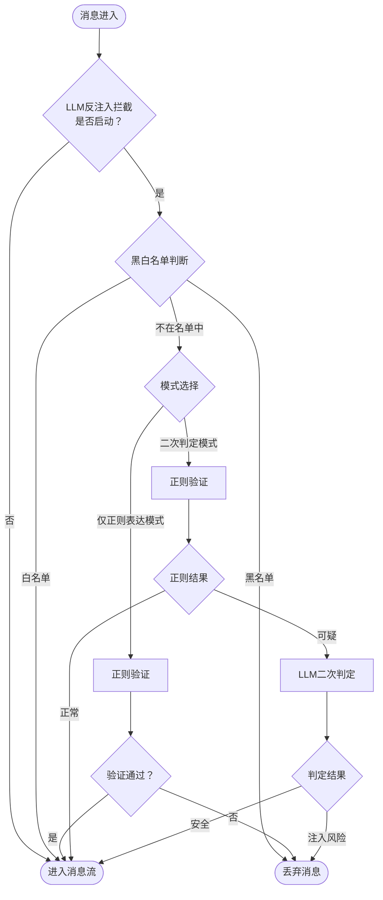

```mermaid
flowchart TD
    A([消息进入]) --> B{LLM反注入拦截
    是否启动？}
    B -- 否 --> Z([进入消息流])
    B -- 是 --> C{黑白名单判断}
    C -- 黑名单 --> D([丢弃消息])
    C -- 白名单 --> Z
    C -- 不在名单中 --> E{模式选择}
    E -- 仅正则表达模式 --> F[正则验证] --> G{验证通过？}
    G -- 是 --> Z
    G -- 否 --> D
    E -- 二次判定模式 --> H[正则验证] --> I{正则结果}
    I -- 正常 --> Z
    I -- 可疑 --> J[LLM二次判定] --> K{判定结果}
    K -- 安全 --> Z
    K -- 注入风险 --> D
```