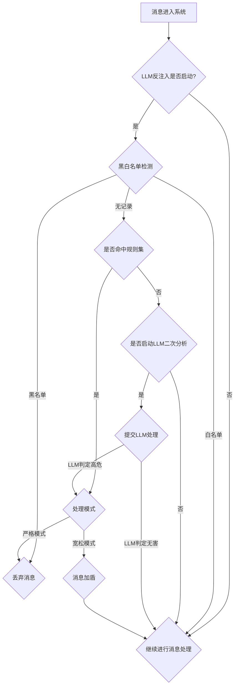

```mermaid
flowchart TD
    A[消息进入系统] --> B{LLM反注入是否启动?}
    B -->|是| C{黑白名单检测}
    B -->|否| Y
    C -->|白名单| Y{继续进行消息处理}
    C -->|无记录| D{是否命中规则集}
    C -->|黑名单| X{丢弃消息}
    D -->|否| E{是否启动LLM二次分析}
    D -->|是| G{处理模式}
    E -->|是| F{提交LLM处理}
    E -->|否| Y
    F -->|LLM判定高危| G
    F -->|LLM判定无害| Y
    G -->|严格模式| X
    G -->|宽松模式| H{消息加盾}
    H --> Y
```   
